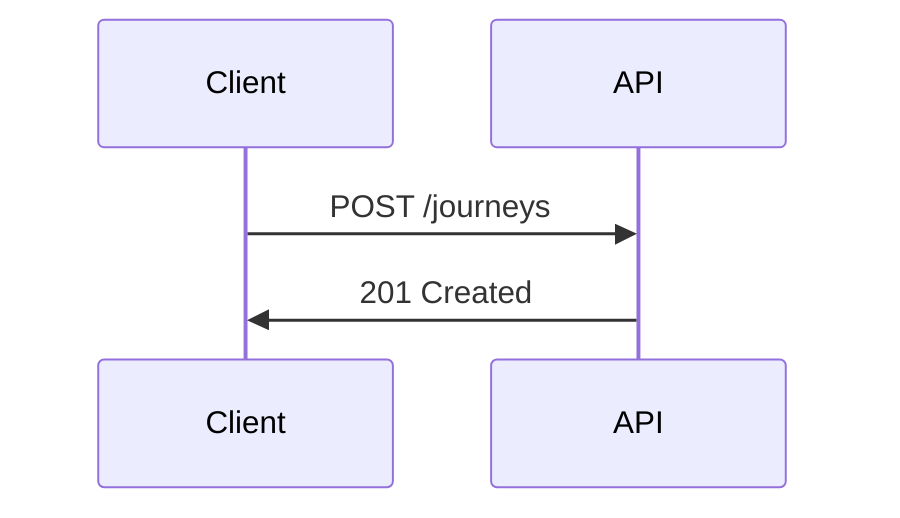

# Zudoku conventions for the Entur Developer Portal

The Entur Developer Portal is built on [Zudoku](https://zudoku.dev). Pages
are Markdown files (`.md`) or MDX files (`.mdx`). The reviewer enforces
Zudoku-specific conventions on top of the general writing standards.

All Zudoku documentation pages are also available as plain Markdown by
appending `.md` to the URL -- link to those when referencing Zudoku's
own docs, so the reviewer can consume them directly. Example:
<https://zudoku.dev/docs/writing.md> instead of
<https://zudoku.dev/docs/writing>.

## Authoritative Zudoku source pages

When in doubt, consult the current Zudoku docs. These are the pages the
reviewer treats as canonical:

- Index: <https://zudoku.dev/llms.txt>
- Writing overview: <https://zudoku.dev/docs/writing.md>
- Markdown features: <https://zudoku.dev/docs/markdown/overview.md>
- Admonitions / callouts: <https://zudoku.dev/docs/markdown/admonitions.md>
- Frontmatter: <https://zudoku.dev/docs/markdown/frontmatter.md>
- MDX: <https://zudoku.dev/docs/markdown/mdx.md>
- Code blocks: <https://zudoku.dev/docs/markdown/code-blocks.md>
- Navigation: <https://zudoku.dev/docs/configuration/navigation.md>

Component reference pages (use when auditing a specific MDX import):

- Alert: <https://zudoku.dev/docs/components/alert.md>
- Badge: <https://zudoku.dev/docs/components/badge.md>
- Button: <https://zudoku.dev/docs/components/button.md>
- Callout: <https://zudoku.dev/docs/components/callout.md>
- Card: <https://zudoku.dev/docs/components/card.md>
- CodeTabs: <https://zudoku.dev/docs/components/code-tabs.md>
- Mermaid: <https://zudoku.dev/docs/components/mermaid.md>
- Playground: <https://zudoku.dev/docs/components/playground.md>
- Secret: <https://zudoku.dev/docs/components/secret.md>
- Stepper: <https://zudoku.dev/docs/components/stepper.md>

## File extension: prefer `.md`, justify `.mdx`

Default to `.md`. Plain Markdown renders with syntax highlighting,
tables, task lists, collapsible sections, and Zudoku's admonition
syntax -- enough for most portal pages.

Reach for `.mdx` when the page genuinely needs one of Zudoku's React
components (see the list below). When an `.mdx` file uses only Markdown
features, recommend renaming it to `.md`. MDX has two real costs: it
breaks tools that only parse Markdown (diff tools, grep, markdownlint
rules, third-party rendering), and it invites ad-hoc JSX that drifts
from the rest of the portal.

**Rule of thumb:** when a page can be written with an admonition, a
table, and a fenced code block, keep it as `.md`.

## Frontmatter

Every `.md` and `.mdx` page on the Entur Developer Portal carries YAML
frontmatter. The reviewer checks the frontmatter before the body.
Treat a missing required field as a blocking issue -- the page
renders incorrectly and loses its ownership and triage path.

### Required fields (Entur convention)

Three fields are required on every Entur Developer Portal page:

| Field | Description |
|-------|-------------|
| `title` | The page heading shown in the browser tab and search results. |
| `description` | A short summary used in search previews. |
| `owner` | Your GitHub team name (for example `team-api`). Must start with `team-`. |

Example of the minimum valid frontmatter:

```yaml
---
title: My page title
description: A short description of what this page covers.
owner: team-my-team
---
```

The `owner` field is an Entur convention layered on top of Zudoku's
fields. It names the GitHub team that owns the page, which is how we
route triage and stale-content reviews. The reviewer treats a missing
or malformed `owner` as a blocking issue. Conventions:

- Starts with `team-`
- Matches a real GitHub team slug
- Always names a team
- When the author is unsure, leave
  `<!-- REVIEWER: confirm GitHub team -->` and let the author fill it in

### Optional fields (from Zudoku)

See <https://zudoku.dev/docs/markdown/frontmatter.md> for the authoritative
list. The fields commonly seen on portal pages:

| Field | Type | Purpose |
|-------|------|---------|
| `category` | string | Organisational context shown above the main heading |
| `sidebar_label` | string | Shorter navigation label (when the title is long) |
| `sidebar_icon` | string | Lucide icon identifier next to the sidebar entry |
| `navigation_display` | string | Visibility controls in navigation |
| `toc` | boolean (default `true`) | Show or hide the table of contents |
| `disable_pager` | boolean | Hide prev/next page navigation |
| `showLastModified` | boolean | Override default last-modified display |
| `draft` | boolean | Exclude from production builds |
| `lastModifiedTime` | ISO 8601 | Auto-set from Git; manual override available |

### Frontmatter conventions the reviewer enforces

- **`title`** -- Zudoku renders this as the page's H1. Set it in
  frontmatter and let the body start at H2 (or at prose). When the
  body has a duplicate `# Title` line, remove it
- **`description`** -- one complete sentence, used by search engines
  and the portal's own listings
- **`owner`** -- present and follows the `team-<name>` format. The
  reviewer asks the author to confirm the slug rather than inventing
  one
- **`sidebar_label`** -- set when the title runs longer than ~40
  characters or when multiple pages share a prefix and the sidebar
  needs disambiguation
- **`draft: true`** -- signals the author is still working. The
  reviewer lets `draft` pages through, and notes when `draft` looks
  like it was left on by accident

## Diagrams: use Mermaid

Entur encourages Mermaid for all diagrams on the Developer Portal -- it
keeps diagrams versioned alongside the prose and legible in diff tools.
The reviewer should recommend Mermaid whenever a draft:

- Contains a static image of an architecture diagram, sequence diagram,
  flowchart, or ER diagram that could be expressed in Mermaid
- Tries to draw an ASCII diagram in a fenced code block
- Describes a multi-step flow in prose that would read more clearly as a
  sequence diagram

### Syntax: prefer the fenced code block

Plain Markdown supports Mermaid through a fenced code block with the
`mermaid` language tag. This is the default and works in `.md` without
MDX. Zudoku renders it at build time into an inline SVG.

````markdown

````

In `.mdx`, the `<Mermaid>` component is also available for client-side
rendering. The fenced code block stays the default; flip
`<Mermaid chart="...">` to a fenced code block and keep the component
only when the page genuinely needs client-side rendering (for example,
diagrams generated from dynamic data). See
<https://zudoku.dev/docs/guides/mermaid.md> for setup details.

### Diagram conventions the reviewer enforces

- **Keep diagrams small.** More than twenty nodes is a sign the diagram
  should be split or replaced with a table
- **Label every edge** whose direction could be ambiguous. A labelled
  arrow tells the reader what the relationship is
- **Direction matches the content**: left-to-right (`graph LR`,
  `flowchart LR`) for process flows, top-to-bottom for hierarchies
- **Colours come from the theme.** When a diagram needs branded
  colours, treat it as a theming concern the whole portal applies;
  keep per-diagram inline styles out of the Markdown source

## Admonitions (plain Markdown, no MDX needed)

Zudoku supports five admonition types in plain Markdown. Prefer these
over prose "Note: ..." or "Important: ..." constructions, and over
importing `<Callout>` from MDX.

```markdown
:::note

Neutral reminder or aside.

:::

:::tip

Helpful but optional advice.

:::

:::info

Background context the reader might want.

:::

:::warning

Something the reader must be careful about.

:::

:::danger

Something that will cause harm if ignored (data loss, security issue).

:::
```

### Admonition conventions the reviewer enforces

- **Keep blank lines around the directive** (`:::note` and `:::`
  lines). Prettier needs those blank lines to leave the admonition
  intact on save
- **Use titles sparingly.** `:::warning{title="..."}` is supported but
  often the first sentence of the admonition reads better than a title
- **One admonition per idea.** When three warnings stack in a row,
  merge them or promote the content to a proper section
- **Admonitions stay as asides.** Use H2 for section headers; reserve
  admonitions for content that genuinely sits outside the reading flow

## Zudoku components (MDX only)

If a page is `.mdx`, the reviewer should check that imported components are
used idiomatically. The full list of Zudoku components is below. Most
documentation pages need at most one or two. If a page imports more than
three, consider whether the content should be split.

| Component | Use case |
|-----------|----------|
| `Alert` | Highlighted message, richer than an admonition |
| `Badge` | Inline status indicator ("Beta", "Deprecated") |
| `Button` | Link-like element styled as a button; use when a page has a primary CTA |
| `Callout` | Emphasis box; prefer admonitions unless you need custom styling |
| `Card` | Content container, useful for "Next steps" grids on landing pages |
| `Checkbox`, `Input`, `Label`, `Select`, `Slider`, `Switch`, `Textarea` | Form controls, used in interactive examples |
| `ClientOnly` | Wrapper for content that must render only in the browser |
| `CodeTabs` | Multi-language code samples in tabs |
| `Dialog` | Modal; rare in docs, occasionally for previews |
| `Head` | Inject metadata into the HTML head |
| `Icons` | Lucide icons inline in content |
| `Link` | Styled link, usually unnecessary -- prefer plain Markdown links |
| `Markdown` | Render Markdown inside JSX expressions |
| `Mermaid` | Mermaid diagrams (sequence, flowchart, ER) |
| `Playground` (API Playground) | Interactive API request/response widget |
| `Secret` | Display and manage an API key in-page |
| `Slot` | Low-level slot management, advanced use |
| `Stepper` | Sequential step UI; **prefer numbered H2 headings for guides** |
| `Syntax Highlight` | Explicit code highlighting, rarely needed over fenced blocks |
| `Tooltip` | Hover context, rarely used in docs |
| `Typography` | Text styling, rarely used in docs |

### Component conventions the reviewer enforces

- **`CodeTabs`** -- earns its place when a single example needs to
  appear in multiple languages (curl / Java / Python). For variants
  inside one language, show the canonical example and describe the
  variant in prose
- **`Mermaid`** -- good for architecture diagrams and sequence diagrams.
  Keep diagrams small; large diagrams belong in SVG
- **`Playground`** -- excellent for reference pages. When a reference
  page documents an endpoint, a `Playground` usually belongs on the page
- **`Stepper`** -- tempting for how-to guides, but Entur guides use
  numbered H2 headings (`## 1 ...`, `## 2 ...`) for steps. Prefer headings
- **`Callout`** -- prefer admonitions. Flag `<Callout>` use that could be
  an admonition instead
- **`Button`** -- rarely needed in docs. A plain Markdown link is almost
  always clearer
- **Imports** -- should be at the top of the file, alphabetised, grouped
  by source

## When to flip `.md` → `.mdx`

Recommend the upgrade when the draft needs something admonitions,
tables, code blocks, and Markdown links already cover:

- Interactive API playground on a reference page
- A Mermaid diagram that would otherwise live as a static image
- A `CodeTabs` block with multi-language samples
- A `Secret` component for API key management

When none of these apply, keep the page as `.md`.

## When to flip `.mdx` → `.md`

Recommend the downgrade when:

- The file imports components and leaves them unused
- Every rendered component has a plain-Markdown equivalent (admonitions
  in place of `<Callout>`, fenced code blocks in place of
  `<Syntax Highlight>`, numbered headings in place of `<Stepper>`)
- The JSX exists only for styling that CSS or admonitions can handle
